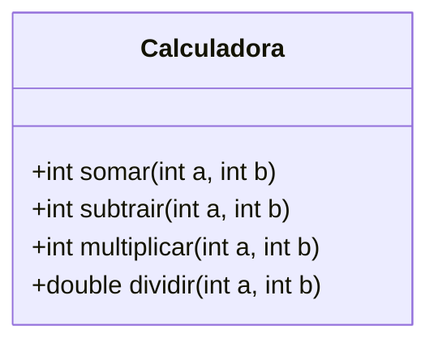

# Roteiro de Estudo e Atividade Prática

## Test‑Driven Development (TDD) com JUnit 5 no IntelliJ IDEA

### Objetivos

* Compreender o ciclo **Red‑Green‑Refactor** da metodologia TDD.
* Escrever testes unitários em Java usando o framework **JUnit 5**.
* Utilizar o **IntelliJ IDEA** como ambiente de desenvolvimento e execução de testes.
* Implementar e validar a classe **Calculadora**.
---

### Pré‑requisitos

* Java 17 ou superior instalado.
* IntelliJ IDEA (Community ou Ultimate) instalado.
* Conhecimentos básicos de programação orientada a objetos em Java.

---

### 1. Introdução rápida ao TDD

| Fase         | Ação                                                           | Resultado esperado                                        |
| ------------ | -------------------------------------------------------------- | --------------------------------------------------------- |
| **Red**      | Escreva um teste que descreva o comportamento desejado.        | O teste **falha** – comportamento ainda não implementado. |
| **Green**    | Implemente o código mínimo para o teste passar.                | O teste **passa** – funcionalidade implementada.          |
| **Refactor** | Melhore a estrutura do código mantendo todos os testes verdes. | Código limpo e coberto por testes.                        |

**Benefícios:** menor retrabalho, código auto‑documentado, regressão controlada.

---

### 2. Fundamentos do JUnit 5

* **Plataforma JUnit**: descobre e executa testes.
* **Módulo Jupiter**: novas anotações (`@Test`, `@BeforeEach`, `@AfterEach`, etc.).
* **Assertions**: `assertEquals`, `assertThrows`, `assertAll`, entre outras.
* **Integração com IntelliJ**: botão *Run* ao lado do método de teste, cobertura, e depuração.

---

### 3. Configuração do Projeto no IntelliJ IDEA

1. *File ▸ New ▸ Project...* → **Java** → marque **Add Sample Code** *(opcional)*.
2. Selecione o *JDK* 17 ou superior.
3. Escolha **Gradle** ou **Maven**.
   *Para **Gradle**, adicione em `build.gradle`:*

   ```groovy
   testImplementation 'org.junit.jupiter:junit-jupiter:5.10.2'
   test {
       useJUnitPlatform()
   }
   ```
4. Clique em *Finish*. O IntelliJ baixa as dependências automaticamente.
5. Crie o pacote `br.com.exemplo.calculadora`.

---

### 4. Classe de Domínio



> **Regra de negócio**: divisão por zero deve lançar `IllegalArgumentException`.

---

### 5. Passo a Passo da Atividade Prática

| Etapa | Ação                                                                                                | Dica didática                                       |
| ----- | --------------------------------------------------------------------------------------------------- | --------------------------------------------------- |
| 5.1   | Crie a classe `Calculadora`.                                                                        | Mantenha-a *stateless* (sem atributos).             |
| 5.2   | Em cada método, coloque: <br>`throw new UnsupportedOperationException("Não implementado");`         | **Red** – todos os testes devem falhar.             |
| 5.3   | Crie `CalculadoraTest` em `src/test/java`. Use `@DisplayName` para tornar o relatório mais legível. | Utilize o modelo *AAA* (Arrange, Act, Assert).      |
| 5.4   | Escreva um teste para **cada** método, incluindo casos de borda (ex.: divisão por zero).            | Use `assertThrows` para exceções.                   |
| 5.5   | Execute a suíte de testes (Ctrl + Shift + F10).                                                     | Verifique o painel *Run* – todos vermelhos.         |
| 5.6   | Implemente a lógica correta na `Calculadora`.                                                       | **Green** – volte a executar os testes.             |
| 5.7   | Refatore nomes e extraia métodos comuns mantendo testes verdes.                                     | Ative o plugin *Coverage* para avaliar porcentagem. |

---

#### Exemplo de Teste

```java
@DisplayName("Divisão deve lançar exceção quando divisor é zero")
@Test
void dividir_divisorZero_deveLancarExcecao() {
    Calculadora calc = new Calculadora();
    assertThrows(IllegalArgumentException.class,
                 () -> calc.dividir(10, 0),
                 "Dividir por zero deveria lançar IllegalArgumentException");
}
```

---

### 6. Evidências para Entrega

1. **Print** da janela de testes com falhas (*fase Red*).
2. **Print** da janela de testes bem‑sucedidos (*fase Green*).
3. Código‑fonte completo de `CalculadoraTest.java` (copiado ou *Export to Text File* do IntelliJ).

> *Dica:* use *Shift + F12* para capturar apenas a janela de resultados no Windows 10+, ou `cmd + shift + 4` no macOS.

---


### 7. Referências

* Beck, K. *Test‑Driven Development: By Example*, 2003.
* JUnit 5 User Guide: [https://junit.org/junit5/docs/current/user-guide/](https://junit.org/junit5/docs/current/user-guide/)
* Documentação IntelliJ IDEA: *Testing framework support*.
